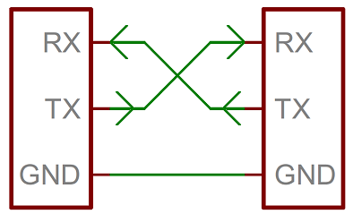
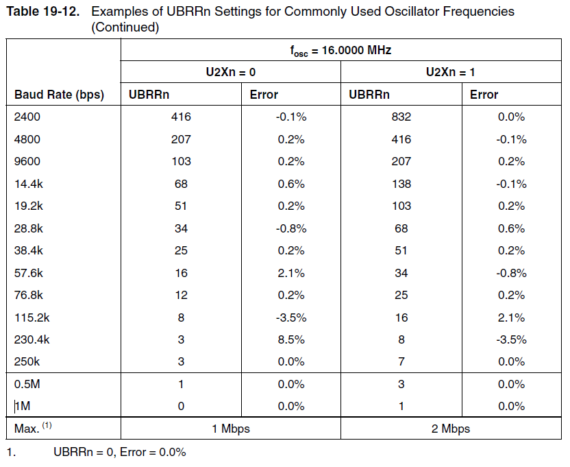

## 시리얼 통신(UART)
* Universal Asynchromous Receiver/Transmitter
* 직렬 통신 방법
* 비동기식 통신 방법
* GPS, Bluetooth.. 에서 사용



#### Baud Rate (통신 속도)
* 데이터의 속도 bit-per-second(bps)
* 통신 속도 값은 1200, 2400, 4800, 19200, 38400, 57600,115200



#### Framing the data (데이터 구조)
* 데이터 구조는
* Start(1bit) + Word Data(8bit) + Parity(1bit) +Stop(1bit)


#### Synchronization bits (동기화 비트)
* Start : IDLE(데이터 전송 없는 상태) -> LOW
* Stop : HIGH

#### Parity bits (패리티 비트)
* 데이터가 제대로 수신 되었는지 확인 하는 비트
    * No : 패리티 비트 사용 X
    * odd : 홀수 패리티 비트
    * even : 짝수 패리티 비트

#### 송신 예제
```arduino
char message = 'A';

void setup(){
  Serial.begin(9600);
  Serial.println("UART START");
}

void loop(){
  Serial.println(message);
  message++;
  
  if(message > 'z'){
    message = 'A';
  }  
  delay(1000);
}
```

#### 수신 예제
```arduino
void setup(){
  Serial.begin(9600);
}

void loop(){
  while(Serial.available()){
    char data = Serial.read();
    Serial.print(data);
  }  
}
```